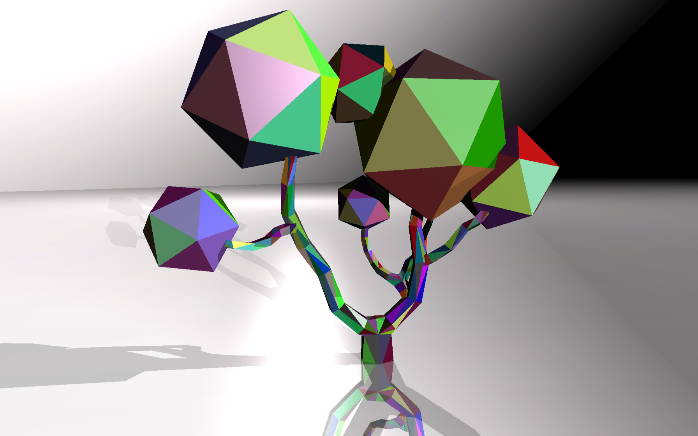
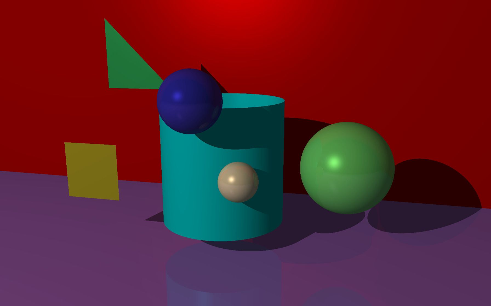
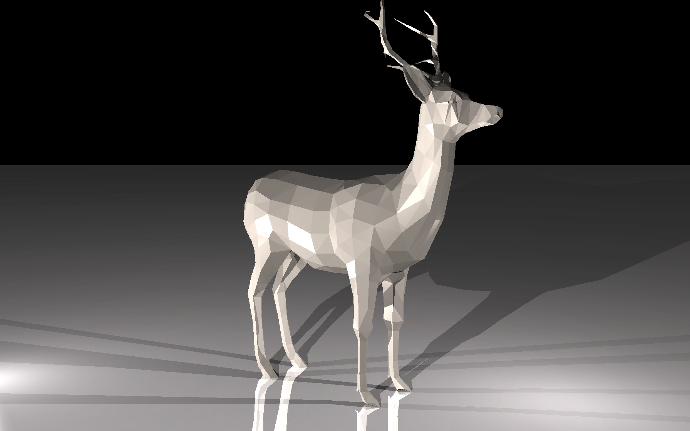
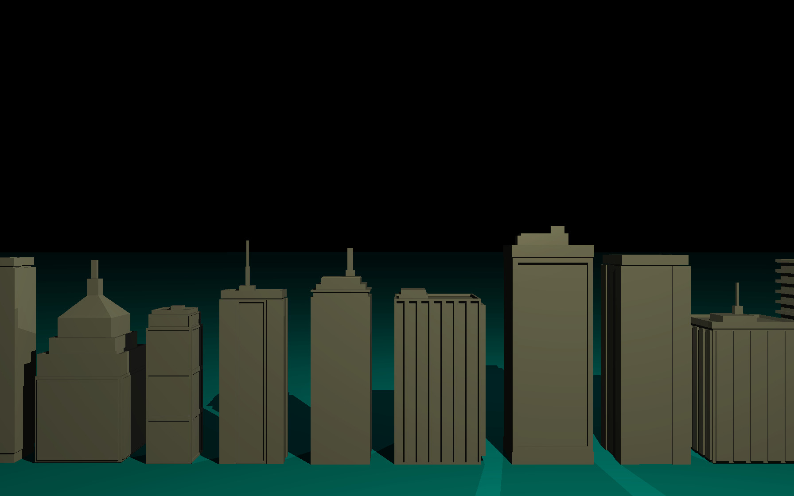
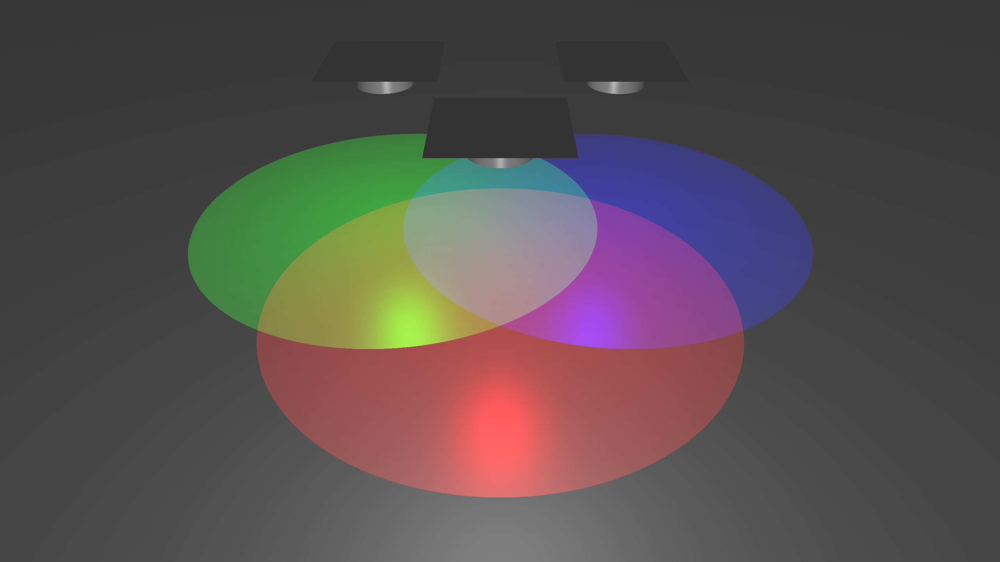
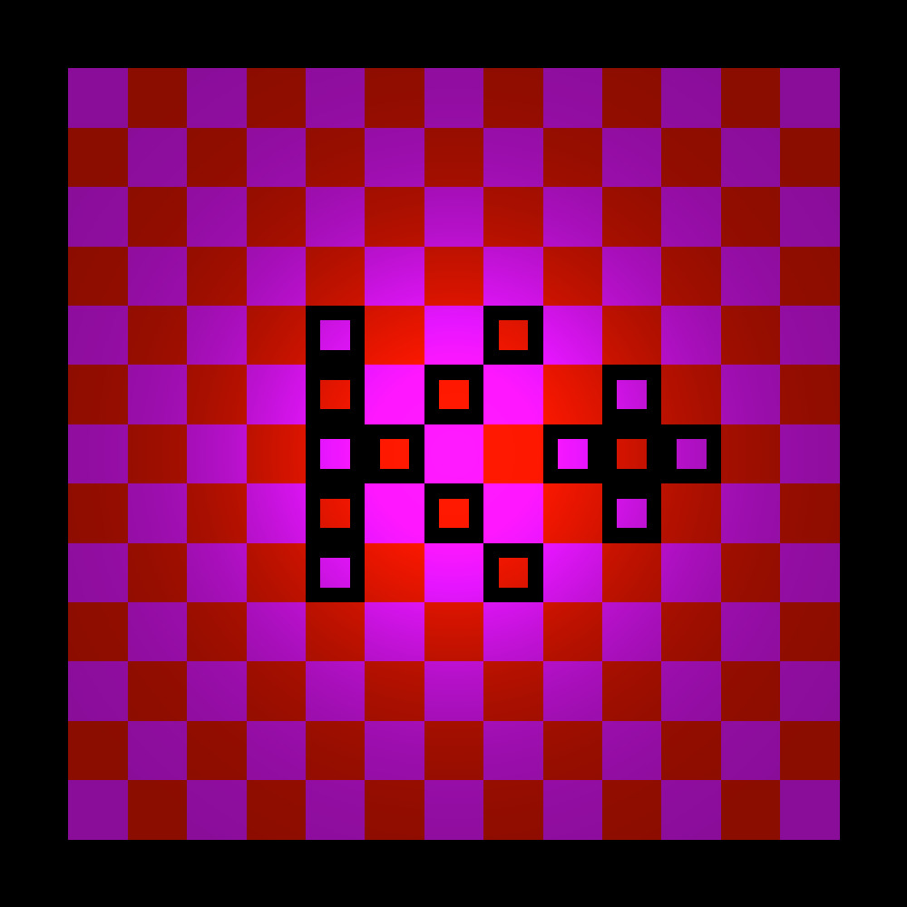

# miniRT - Ray tracer
<div>
    
    
    
</div>



<div>

## Description
A ray-tracing project implemented on CPU. Allows you to generate scenes in 3D containing objects. Each scene can be be viewed by a set of cameras characterized by its position, direction and Field Of View (FOV). This project can be used only with Minilibx so it can work only on macOS.

### Features
+ **Multithreaded render**
+ **Antialiasing**
+ **Real-time camera movement / rotation**
+ **Blinn–Phong lighting model**
+ **Object shadows**
+ **Reflections of objects**
+ **Creating screenshots**


### The supported primitives
+ **Spheres**
+ **Planes**
+ **Cylinders**
+ **Squares**
+ **Triangles**



### How it works
The basic ray tracing model is as follows. A camera is placed in the world and rays are cast from the camera's position to points on an imaginary image plane. A ray is used to determine what light would be going towards the camera at that point and direction. In our case each ray represents a pixel in the output image and the resulting color of the ray determines the color output for the pixel.
</div>

<div>

## Usage
### Installation
> ```commandline 
> git clone https://github.com/Kllaster/miniRT.git && cd miniRT && make
>  ```

### Starting the program
```commandline 
./miniRT <scene_name.rt> [--save] <file_name.bmp>

optional arguments:
  --save - To save the rendered image to a screen.bmp in miniRT directory.
  --save <file_name.bmp> - To save the rendered image in file_name.bmp.
```
</div>


<div>

## Control keys
+ `F5` - To save the rendered image in a file named "screen" in .bmp format.
+ `SPACE` - Changing the camera
+ `ESC` - Turn off the program
### Camera movement
+ `W` - Move forward
+ `S` - Move backwards
  </br></br>
+ `A` - Move to the left
+ `D` - Move to the right
  </br></br>
+ `Z` - Move up
+ `X` - Move down
### Camera rotation
Depending on the direction of the camera, the buttons may change.
+ `Q` - Turn left
+ `E` - Turn right
  </br></br>
+ `↑` - Turn up
+ `↓` - Turn down
</br></br>
+ `←` - Turn left
+ `→` - Turn right
### Changing scene objects
Works with spheres, cylinders and squares.
+ `LBM (Left Button Mouse)` - Increasing the size of the object
+ `RBM (Right Button Mouse)` - Reducing the size of the object
</div>

<div>

## Scenes
Click on the image for larger size

```commandline 
./miniRT scenes_files/town.rt
```

</br></br>

```commandline 
./miniRT scenes_files/knife.rt
```

</br></br>

```commandline 
./miniRT scenes_files/lights.rt
```

</br></br>

```commandline 
./miniRT scenes_files/board.rt
```

</div>

<div>

## Scene format
Each element first’s information is the type identifier (composed by one or two character(s)), followed by all specific information for each object in a strict order. You can write empty lines and object order is meaningless, just don't forget ambient and resolution. (If you dont like ambient light effect you can deactivate putting a 0 in ratio).
+ Resolution:
  + `R` `1920` `1080` `1`
  + Identifier: `R`
  + Screen width
  + Screen height
  + Antialiasing [0,1] (off, on)
</br></br>
+ Ambient lightning:
  + `A` `0.2` `255,255,255`
  + Identifier: `A`
  + Ambient lighting ratio in range [0.0,1.0].
  + R,G,B colors in range [0-255].
</br></br>
+ Camera:
  + `c` `-50,0,20` `0,0,1` `70`
  + Identifier: `c`
  + x,y,z coordinates of the view point.
  + 3d normalized orientation vector. In range [-1,1] for each x,y,z axis.
  + FOV : Horizontal field of view in degrees in range [0,180].
</br></br>
+ Light:
  + `l` `-45,50,0` `0.6` `10,0,255`
  + Identifier: `l`
  + x,y,z coordinates of the light point.
  + The light brightness ratio in range [0.0,1.0].
  + R,G,B colors in range [0-255].
</br></br>
+ Sphere:
  + `sp` `0,0,20.6` `12.6` `10,0,255` `0.4`
  + Identifier: `sp`
  + x,y,z coordinates of the sphere center.
  + The sphere diameter.
  + R,G,B colors in range [0-255].
  + Reflection coefficient [0.0-1.0].
</br></br>
+ Plane:
  + `pl` `0,0,-10` `0,0.5,0` `0,0,225` `0.4`
  + Identifier: `pl`
  + x,y,z coordinates.
  + 3d normalized orientation vector. In range [-1,1] for each x,y,z axis.
  + R,G,B colors in range [0-255].
  + Reflection coefficient [0.0-1.0].
</br></br>
+ Square:
  + `sq` `0,0,20.6` `1,0,0` `12.6` `255,0,255` `0.4`
  + Identifier: `sq`
  + x,y,z coordinates of the square center.
  + 3d normalized orientation vector. In range [-1,1] for each x,y,z axis.
  + Side size.
  + R,G,B colors in range [0-255].
  + Reflection coefficient [0.0-1.0].
</br></br>
+ Cylinder:
  + `cy` `50,0,20.6` `0,0,1` `10,0,255` `14.2` `21.42` `0.4`
  + Identifier: `cy`
  + x,y,z coordinates of the cylinder center.
  + 3d normalized orientation vector. In range [-1,1] for each x,y,z axis.
  + The cylinder diameter.
  + The cylinder height.
  + R,G,B colors in range [0-255].
  + Reflection coefficient [0.0-1.0].
</br></br>
+ Triangle:
  + `tr` `10,20,10` `10,10,20` `20,10,10` `0,0,255` `0.4`
  + Identifier: `tr`
  + x,y,z coordinates of the first point.
  + x,y,z coordinates of the second point.
  + x,y,z coordinates of the third point.
  + R,G,B colors in range [0-255].
  + Reflection coefficient [0.0-1.0].
  
### Example
```c
R 1000 1000
A 0.01 255,255,255

c 0,0,0 0,0,1 55

l 10,20,0 0.6 255,255,255

sp 0,0,90 20 32,32,200 0.2
sp 10,20,75 7 255,0,255 0.2
sp -15,20,90 10 0,255,255 0.2
sp -10,-10,30 3 100,0,100 0.2
sq -10,0,70 0.9,0,-1.0 6 0,0,0 1
tr 0,-10,90 -10,0,90 10,20,100 24,43,200 1
pl -25,0,0 -1,0,0 120,0,120
pl 25,0,0 1,0,0 255,200,100
pl 0,0,100 0,0,1 0,120,120
pl 0,25,0 0,1,0 100,200,30
pl 0,-25,0 0,-1,0 0,160,0
```
</div>